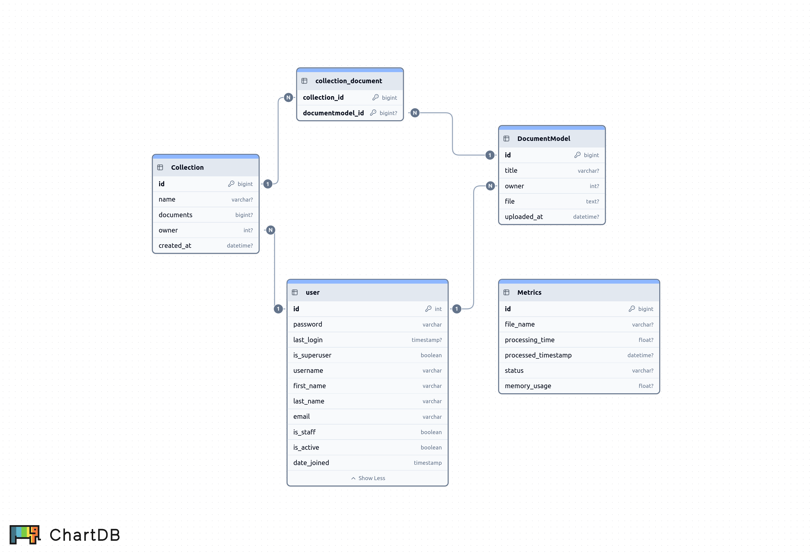

## Структура проекта
```
tf-idf/
├─ docs/                    # Фабрика схем и схемы для документации api (OpenAPI 3)
│  ├─ schema_factory.py     # Фабрика схем
│  ├─ schemas.py            # Схемы
├─ main/
│  ├─ settings.py           # Основыне настройки api
│  ├─ urls.py               # url api
├─ core/
    ├─ doc_collections/         # Приложение для работы с документами и колекциями.
    │  ├─ models.py             # Описание моделей базы данных
    │  ├─ serializers.py        # Сериализаторы
    │  ├─ services.py           # Сервисы для инфроструктуры
    │  ├─ signals.py            # настройки сигналов
    │  ├─ urls.py               # url приложения
    │  ├─ views.py              # Описание вью
    │
    ├─ tfidf_app/               # Основное приложение
    │  ├─ admin.py              # настройки админ панели
    │  ├─ models.py             # Описание моделей базы данных
    │  ├─ serializers.py        # Сериализаторы
    │  ├─ urls.py               # url приложения
    │  ├─ utils.py              # Утилиты, расчеты
    │  ├─ version.py            # Версия api в формате SemVer
    │  ├─ views.py              # Описание вью
    │
    ├─ user/                    # Приложение для юзера
    │  ├─ admin.py              # настройки админ панели
    │  ├─ models.py             # Описание моделей базы данных
    │  ├─ serializers.py        # Сериализаторы
    │  ├─ urls.py               # url приложения
    │  ├─ views.py              # Описание вью
├─ .example.env             # Шаблон переменных окружения
├─ CHANGELOG.md             # Описание обновлений, изменений и исправлений проекта
├─ docker-compose.yml       # Оркестрация контейнеров
├─ Dockerfile               # Конфигурация Docker
├─ entrypoint.prod.sh       # Конфигурации точки входа при сборке приложения
├─ nginx.conf               # Конфигурация nginx
├─ README.md                # Описание проекта
├─ requirements.txt         # Зависимости Python
```

## Запуск приложения
### Зависимости
    - Docker 28.2+
    - docker-compose 2.19+
    - PostgreSQL 17+
    - GIT

### Запуск 
    - клонировать репозиторий: git clone https://github.com/Dvaraz/tf-idf
    - cd tf-idf
    - Скопировать конфиг: 'cp .example.env .env.prod'
    - Заполнить параметры в '.env.prod'
    - Запустить: 'docker compose up --build'
    - Запустить команду: sudo docker exec -it django-docker python manage.py createsuperuser - для создания суперпользователя
    - Приложение будет доступно на порту 8001

### Использование
    - Документация OpenApi будет доступна: http://host:8001/api/
    
    - Регистрация происходит при помощи email и password передаваемые в теле запроса: /api/v1/auth/login/ 
    - после регистрации ответ будет содержать access и refresh токены: {"access": "...", "refresh": "..."}
    - access token используетсря в заголовках для запросов: Authorization: Bearer token

### Конфигурируемые параметры 
    - Параметры настраиваются в '.env.prod':

    # Django Settings
    - DEBUG: режим отладки  - по умолчанию False
    - SECRET_KEY: секретный ключ для api
    - DJANGO_ALLOWED_HOSTS: допустимые хосты
    - DJANGO_CSRF_TRUSTED_ORIGINS
    
    # Database Settings
    - DATABASE_NAME: название базы данных - должно совподать с POSTGRES_DB
    - DATABASE_USERNAME: имя пользователя для базы данных - должно совподать с POSTGRES_USER
    - DATABASE_PASSWORD: пароль базы данных - должно совподать с POSTGRES_PASSWORD
    - DATABASE_HOST: хост базы данных
    - DATABASE_PORT: порт базы данных - по умолчанию 5432
    
    # Postgres Settings
    - POSTGRES_DB: название базы данных
    - POSTGRES_USER: имя пользователя для базы данных
    - POSTGRES_PASSWORD: пароль базы данных

    # Smtp settings
    - DEFAULT_FROM_EMAIL: адресс smtp сервиса
    - EMAIL_HOST_PASSWORD: пароль smtp сервиса

## Структура базыданных:

<div align="center">
  
</div>